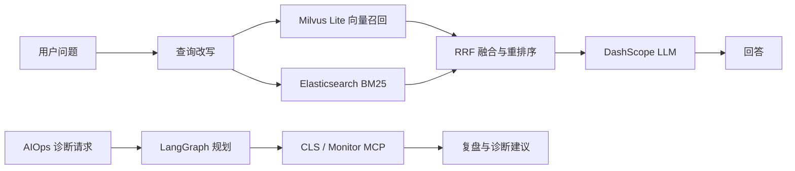

# SuperOpsAgent

SuperOpsAgent 是一个面向 On-Call 场景的智能运维助手。项目使用 FastAPI 提供 Web
与 API 服务，通过 LangGraph 编排 RAG 问答和 AIOps 诊断流程，并结合 Milvus Lite、
Elasticsearch、DashScope 和 MCP 完成知识检索、告警分析与诊断建议生成。

当前版本以本地开发和功能验证为主：Milvus Lite 直接使用本地数据库文件，
Elasticsearch 使用本机服务，CLS 与 Monitor MCP 返回模拟数据，不需要 Docker。

## 主要能力

- RAG 问答：向量召回与 Elasticsearch BM25 双路检索。
- 混合排序：支持 RRF 融合、Cross-Encoder 重排序和查询改写。
- 文档知识库：上传 Markdown 文档后自动分块并建立向量及全文索引。
- AIOps 诊断：使用 Plan-Execute-Replan 工作流调用日志和监控 MCP 工具。
- 流式输出：聊天和 AIOps 诊断均支持 SSE。
- 离线评测：内置 Ragas 数据集加载、执行和 JSON 报告输出。
- 本地运行：Milvus Lite 无需独立服务或 Docker。

## 系统流程



## 环境要求

- Python 3.11、3.12 或 3.13。
- Elasticsearch 9.x；本项目已使用 9.2.4 验证。
- DashScope API Key，用于对话、查询改写、向量嵌入和评测。
- Windows 推荐安装 `uv`；未安装时启动脚本会回退到 `pip`。

默认服务地址：

| 服务 | 地址 | 说明 |
| --- | --- | --- |
| Web/API | `http://localhost:18000` | FastAPI 与静态页面 |
| API 文档 | `http://localhost:18000/docs` | Swagger UI |
| Elasticsearch | `http://localhost:9200` | 本地 Elasticsearch 9.x |
| CLS MCP | `http://localhost:18003/mcp` | 模拟日志查询 |
| Monitor MCP | `http://localhost:18004/mcp` | 模拟监控查询 |

项目使用 `18000` 作为默认 API 端口，避免部分 Windows/Hyper-V 环境保留
`9808-10007` 端口段导致 `9900` 无法绑定。

## 快速开始：Windows


创建本地配置：

```powershell
copy .env.example .env
notepad .env
```

至少填写：

```dotenv
DASHSCOPE_API_KEY=你的DashScopeKey
```

先启动本地 Elasticsearch，并确认以下地址可访问：

```powershell
curl.exe http://localhost:9200
```

随后执行一键启动：

```powershell
.\start-windows.bat
```

脚本会依次完成：

1. 检查 `uv` 和 Python 环境。
2. 创建或同步 `.venv`。
3. 检查 Elasticsearch。
4. 准备 `data/` 下的 Milvus Lite 数据库。
5. 启动 CLS MCP、Monitor MCP 和 FastAPI。
6. 健康检查成功后，自动上传 `aiops-docs\*.md`。

停止项目：

```powershell
.\stop-windows.bat
```

## 手动启动

安装依赖：

```powershell
uv sync
.\.venv\Scripts\activate
```

在三个终端中分别运行：

```powershell
python mcp_servers\cls_server.py
```

```powershell
python mcp_servers\monitor_server.py
```

```powershell
python -m uvicorn app.main:app --host 0.0.0.0 --port 12000
```

Linux/macOS 可使用对应的 `/` 路径，也可以执行：

```bash
make init
make start
```

仅手动启动 Uvicorn 不会自动扫描 `aiops-docs`。需要通过 `/api/upload` 上传文档，
或自行遍历目录调用该接口。

## AIOps 知识文档

`aiops-docs/` 保存启动时导入的 Markdown 运维知识。当前包含 CPU、内存、磁盘、
服务不可用和响应缓慢等示例，以及只有 3 条内容的测试文件：

```text
aiops-docs/
├── cpu_high_usage.md
├── disk_high_usage.md
├── memory_high_usage.md
├── service_unavailable.md
├── slow_response.md
└── test_knowledge.md
```

修改或新增文档后，重新运行 `start-windows.bat` 会再次上传全部 Markdown 文件。
当前运行中的 API 不会实时监控该目录。

手动上传单个文件：

```powershell
curl.exe -X POST http://localhost:12000/api/upload `
  -F "file=@aiops-docs/test_knowledge.md"
```

## 配置

完整模板见 `.env.example`，本地值写入 `.env`。`.env` 已被 Git 忽略，不应提交
API Key 或其他凭据。

### 应用与模型

| 变量 | 默认值 | 说明 |
| --- | --- | --- |
| `HOST` | `0.0.0.0` | API 监听地址 |
| `PORT` | `12000` | API 端口 |
| `DASHSCOPE_API_KEY` | 空 | 必填的 DashScope Key |
| `DASHSCOPE_API_BASE` | 北京兼容模式地址 | DashScope Key 所属地域的 API 地址 |
| `DASHSCOPE_MODEL` | `qwen-max` | 通用对话模型 |
| `DASHSCOPE_EMBEDDING_MODEL` | `text-embedding-v4` | 1024 维嵌入模型 |
| `RAG_MODEL` | `qwen-max` | RAG 回答模型 |
| `RAG_TEMPERATURE` | `0.1` | RAG 回答采样温度；低值减少随机扩展 |
| `RAG_MAX_TOKENS` | `1200` | RAG 单次回答最大输出 Token 数 |
| `RAG_ENABLE_THINKING` | `false` | 是否启用扩展思考；默认关闭以减少发散 |
| `RAG_CONTEXT_SUMMARY_MODEL` | `qwen3.5-flash` | 滚动摘要模型，建议使用轻量模型 |
| `RAG_CONTEXT_SUMMARY_TRIGGER_MESSAGES` | `12` | 累积到多少条消息后触发滚动摘要 |
| `RAG_CONTEXT_SUMMARY_KEEP_MESSAGES` | `6` | 摘要后保留最近消息条数 |
| `RAG_QUERY_REWRITE_MODEL` | 空 | 空值时复用 RAG 主模型 |
| `EVAL_MODEL` | `qwen-max` | 离线评测模型 |
| `EVAL_METRIC_TIMEOUT` | `90` | 普通指标和单次评测 HTTP 请求超时秒数 |
| `EVAL_FAITHFULNESS_TIMEOUT` | `300` | Faithfulness 整项评分超时秒数 |
| `EVAL_FAITHFULNESS_STATEMENT_BATCH_SIZE` | `10` | Faithfulness 单次 NLI 判定的陈述数，避免长回答产生过大的结构化输出 |
| `EVAL_ANSWER_CORRECTNESS_TIMEOUT` | `240` | Answer Correctness 整项评分超时秒数 |
| `EVAL_METRIC_MAX_CONCURRENCY` | `2` | 同时运行的 Ragas 指标数 |
| `EVAL_CLIENT_MAX_RETRIES` | `3` | 评测客户端瞬时失败重试次数 |

`DASHSCOPE_API_BASE` 必须与 Key 的地域一致。默认值是北京地域：

```dotenv
DASHSCOPE_API_BASE=https://dashscope.aliyuncs.com/compatible-mode/v1
```

例如新加坡地域应使用 `https://dashscope-intl.aliyuncs.com/compatible-mode/v1`。
项目会把该配置同时传给 ChatQwen、ChatOpenAI 和向量嵌入客户端，避免不同模型
请求落到不同地域。

### Milvus Lite 与 Elasticsearch

| 变量 | 默认值 | 说明 |
| --- | --- | --- |
| `MILVUS_LITE_PATH` | `./data/milvus.db` | 本地数据库文件 |
| `MILVUS_LITE_DB_NAME` | `default` | 数据库名称 |
| `MILVUS_TIMEOUT` | `10000` | 连接超时，毫秒 |
| `ES_SCHEME` | `http` | Elasticsearch 协议 |
| `ES_HOST` | `localhost` | Elasticsearch 主机 |
| `ES_PORT` | `9200` | Elasticsearch 端口 |
| `ES_INDEX` | `biz` | 全文索引名称 |
| `ES_ANALYZER` | `standard` | 建索引分词器 |
| `ES_SEARCH_ANALYZER` | `standard` | 查询分词器 |

只有本地 Elasticsearch 已安装 IK 插件时，才应将分词器改成
`ik_max_word` 和 `ik_smart`。

### 检索与 MCP

| 变量 | 默认值 | 说明 |
| --- | --- | --- |
| `RAG_TOP_K` | `5` | 最终返回文档数 |
| `RAG_RECALL_SIZE` | `20` | 每路初始召回数 |
| `RAG_RERANK_ENABLED` | `true` | 是否启用重排序 |
| `RAG_RERANK_MODEL` | `BAAI/bge-reranker-base` | 本地重排序模型 |
| `RAG_RERANK_WARMUP_ENABLED` | `true` | 启动 API 或离线评测时是否提前预热重排模型 |
| `RAG_RERANK_WARMUP_TIMEOUT` | `120` | 重排模型预热超时秒数 |
| `RAG_QUERY_REWRITE_ENABLED` | `true` | 是否启用查询改写 |
| `LLM_TIMEOUT` | `30` | 统一 LLM 调用超时秒数 |
| `LLM_MAX_RETRIES` | `2` | 网络错误、429、5xx 的最大重试次数 |
| `LLM_MAX_CONCURRENCY` | `8` | LLM 并发限流上限 |
| `LLM_MIN_INTERVAL` | `0` | LLM 请求最小启动间隔秒数 |
| `LLM_CIRCUIT_FAILURE_THRESHOLD` | `3` | 连续失败多少次后熔断 |
| `LLM_CIRCUIT_RECOVERY_TIMEOUT` | `30` | 熔断恢复探测间隔秒数 |
| `LLM_RETRY_BACKOFF` | `0.25` | 重试指数退避基准秒数 |
| `LLM_FALLBACK_MODEL` | `qwen-turbo` | 主模型失败后的备用模型 |
| `MCP_CLS_URL` | `http://localhost:18003/mcp` | CLS MCP 地址 |
| `MCP_MONITOR_URL` | `http://localhost:18004/mcp` | Monitor MCP 地址 |

## API

| 方法 | 路径 | 用途 |
| --- | --- | --- |
| `GET` | `/api/health` | 检查 Milvus Lite 和 Elasticsearch |
| `POST` | `/api/chat` | 普通 RAG 对话 |
| `POST` | `/api/chat_stream` | SSE 流式 RAG 对话 |
| `POST` | `/api/chat/clear` | 清空指定会话 |
| `GET` | `/api/chat/session/{session_id}` | 获取会话信息 |
| `POST` | `/api/upload` | 上传并索引文档 |
| `POST` | `/api/index_directory` | 索引指定目录 |
| `POST` | `/api/aiops` | SSE 流式 AIOps 诊断 |

普通对话示例。请求字段支持代码定义的别名 `Id` 和 `Question`：

```powershell
curl.exe -X POST http://localhost:12000/api/chat `
  -H "Content-Type: application/json" `
  -d '{"Id":"demo-session","Question":"CPU 持续超过 90% 应该如何排查？"}'
```

健康检查：

```powershell
curl.exe http://localhost:12000/api/health
```

AIOps 诊断：

```powershell
curl.exe -N -X POST http://localhost:12000/api/aiops `
  -H "Content-Type: application/json" `
  -d '{"session_id":"aiops-demo"}'
```

## MCP 数据说明

`mcp_servers/cls_server.py` 和 `mcp_servers/monitor_server.py` 当前提供模拟数据，
用于验证日志搜索、CPU/内存指标、服务状态、进程列表和历史工单等诊断流程。

这两个 MCP 服务不会自动读取真实生产日志或监控系统。生产接入时，需要在对应
Server 中替换数据生成逻辑，并配置腾讯云 CLS、Prometheus、Grafana 或其他实际
数据源的鉴权与 API 调用。

## 离线评测

项目提供一个示例 JSONL 数据集：`eval/fixtures/sample_ragas_dataset.jsonl`。

离线评测会直接打开 Milvus Lite 数据文件。运行前请停止 FastAPI，避免两个进程同时
占用 `data/milvus.db`；Elasticsearch、CLS MCP 和 Monitor MCP 应保持运行。评测命令
会自行初始化并在结束时关闭 Milvus 与 Elasticsearch 客户端。

```powershell
uv run run-ragas-eval `
  --dataset eval/fixtures/sample_ragas_dataset.jsonl
```

默认报告写入 `eval/reports/`。也可以使用 `--output` 指定 JSON 文件路径。

## 开发与测试

安装开发依赖：

```powershell
uv sync --extra dev
```

执行测试和静态检查：

```powershell
python -m pytest tests -q
python -m ruff check app tests
```

Milvus Lite 测试会使用临时数据库，不依赖 Docker 或外部 Milvus Server。

## 运行数据

以下内容只保存在本地，并已通过 `.gitignore` 排除：

- `.env`：本地配置和密钥。
- `.venv/`、`.uv-python/`、`.uv-cache/`：Python 运行环境和缓存。
- `data/`：Milvus Lite 数据文件。
- `logs/`：应用与后台进程日志。
- `.pytest_cache/`、`.mypy_cache/`、`.ruff_cache/`、`htmlcov/`：开发工具产物。

## 常见问题

### Elasticsearch 连接失败

确认 `http://localhost:9200` 可访问，并检查 `.env` 中的 `ES_SCHEME`、`ES_HOST`
和 `ES_PORT`。项目启动时会主动 ping Elasticsearch；连接失败会阻止 API 启动。

### Milvus Lite 无法创建数据库

确认 `MILVUS_LITE_PATH` 的父目录可写。默认使用 `./data/milvus.db`，目录会自动创建。

### MCP 地址返回 406

浏览器直接访问 `/mcp` 时缺少 MCP 协议请求头，返回 406 属于正常现象。应通过
MCP 客户端或项目内的 AIOps 流程调用。

### Windows 日志出现 UnicodeEncodeError

这是 GBK 控制台输出 Emoji 时的编码问题，通常不影响 API 运行。可以先执行
`chcp 65001`，或设置 `PYTHONUTF8=1` 后再启动。

### 文档没有自动上传

自动上传只由 `start-windows.bat` 执行，并且必须等待 `/api/health` 成功。手动启动
Uvicorn 后，需要自行调用 `/api/upload`。
